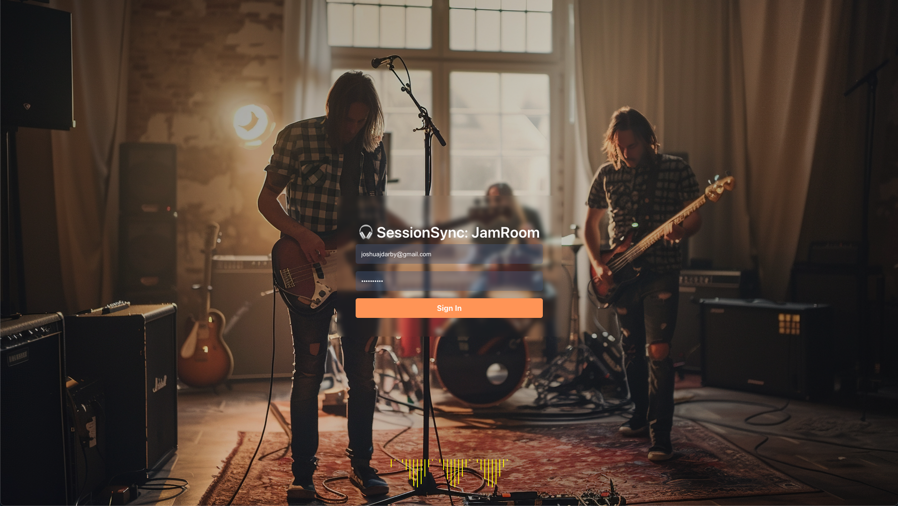

# SessionSync

Desktop-first collaborative music sessions built with React, TypeScript, Rust, and Tauri.



## Overview

SessionSync provides a shared workspace for musicians to collaborate during rehearsals, recording sessions, and remote jam sessions. The application combines session management, track controls, communication tools, and transport controls into a single desktop interface.

## Features

* Multi-user session workspace
* Collaborator monitoring and management
* Track creation and organization
* Volume, pan, mute, and solo controls
* Tempo and count-in management
* Integrated session chat
* Native desktop application powered by Tauri

## Technology Stack

* React 19
* TypeScript
* Vite
* Tauri 2
* Rust
* styled-components
* Material UI Icons

## Architecture

```text
SessionSync
├── React Frontend
│   ├── Session Workspace
│   ├── Track Management
│   ├── Chat System
│   └── User Controls
├── Tauri Desktop Shell
│   ├── Native Window Management
│   └── Application Packaging
└── Rust Backend Layer
```

## Session Workspace

The primary workspace includes:

* Visual session display
* Collaborator panel
* Transport controls
* Track mixer and controls
* Session chat
* Sidebar navigation
* Desktop application shell

## Project Structure

| Directory         | Purpose                         |
| ----------------- | ------------------------------- |
| `src/`            | React application source        |
| `src/components/` | Reusable UI components          |
| `src/views/`      | Route-level views               |
| `src/layouts/`    | Application layouts             |
| `src/contexts/`   | Shared React state              |
| `src/assets/`     | Images, icons, and media        |
| `src-tauri/`      | Tauri and Rust application code |

## Getting Started

### 1. Install Prerequisites

#### Rust

```bash
curl --proto '=https' --tlsv1.2 -sSf https://sh.rustup.rs | sh
```

#### Linux Dependencies (Debian/Ubuntu)

```bash
sudo apt update
sudo apt install libwebkit2gtk-4.0-dev build-essential curl wget file libssl-dev libgtk-3-dev
```

#### Node.js

Install a current LTS version of Node.js.

---

### 2. Clone the Repository

```bash
git clone <repository-url>
cd SessionSync
```

### 3. Install Dependencies

```bash
npm install
```

### 4. Run the Application

```bash
npm run tauri dev
```

### Build Production Bundle

```bash
npm run build
npm run tauri build
```

## Available Scripts

| Command               | Description                       |
| --------------------- | --------------------------------- |
| `npm run dev`         | Start Vite development server     |
| `npm run build`       | Build frontend application        |
| `npm run lint`        | Run ESLint                        |
| `npm run preview`     | Preview production build          |
| `npm run tauri dev`   | Launch desktop app in development |
| `npm run tauri build` | Build desktop installer           |

## Current Status

SessionSync is currently focused on validating the collaborative session workflow and desktop user experience. Audio processing, networking, synchronization, and persistent session infrastructure are planned for future releases.

## Roadmap

* User authentication
* Session persistence
* Real-time collaboration
* Audio routing and monitoring
* Plugin discovery and management
* Project templates and presets
* Auto-updates and installer improvements
